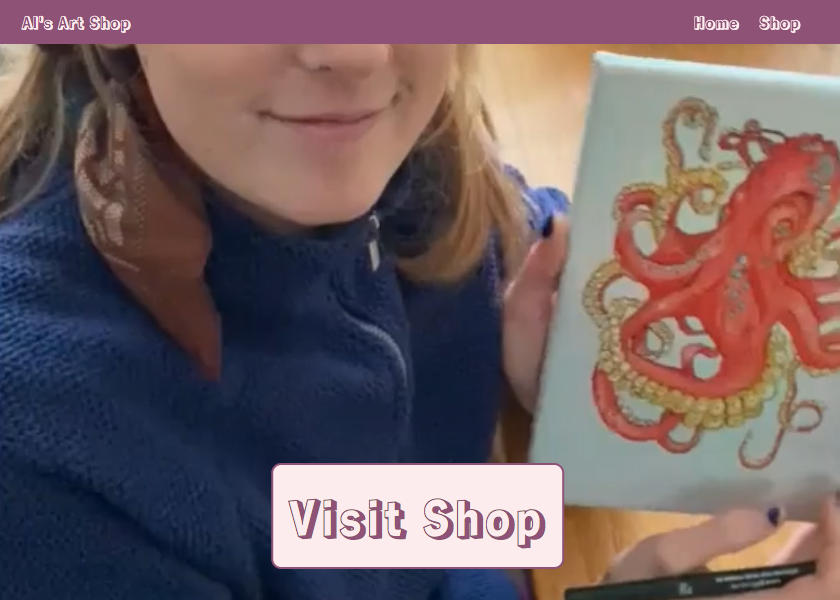
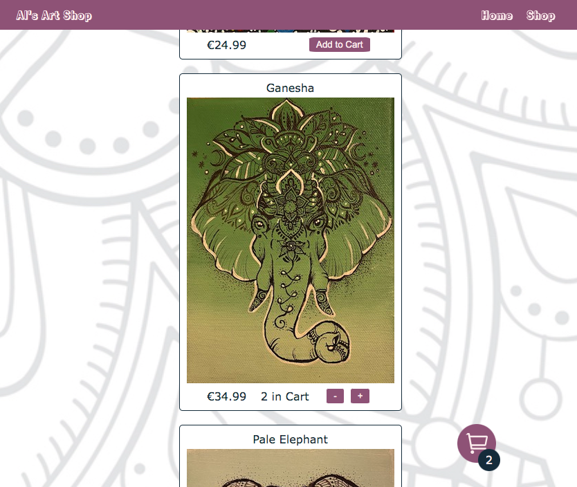
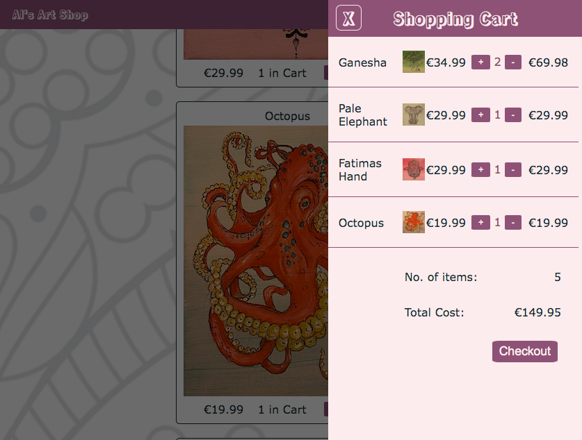

Al's Art Shop is a react web art store. The site is styled to be a quirky art store. A color palette generator was used to create a combination of friendly colours.

It features a home page, with an embedded video that autoplays on landing.

Users can then click the Visit Shop button, or the Shop link in the navigation bar. Both of these make use of the NavLink component from react-router-dom to change the path to /shop, and render the shop component.

The shop component renders each object in the products array. Users can browse the products and add various quantities to their shopping cart.

Local storage is checked first to see if a prior cart exists.

The total cart quantity appears in the bottom corner of the cart icon, which is fixed to the bottom right of the viewport.

Users can increase or decrease the quantities using simple + and - buttons. These appear when a product has a quantity of at least one. Each change in quantity triggers a change in the cart state. A click on the cart icon will open the cart sidebar, which smoothly slides in from the right, as well as darkening the rest of the screen.

The cart displays the products in the cart state. Like in the store, users can increase or decrease quantities with ease. A subtotal for each product is shown, as well as the total price.
